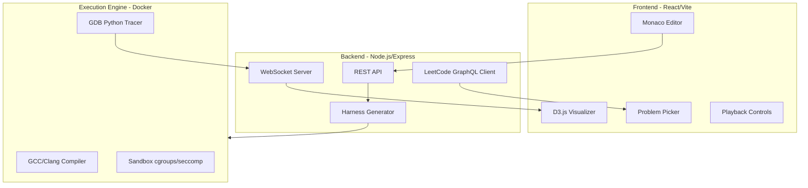

# DSA Code Execution Visualizer - Implementation Plan

## Architecture Overview




## Project Structure

```
dsa-visualizer/
├── frontend/                 # React + Vite + TypeScript
│   ├── src/
│   │   ├── components/
│   │   │   ├── Editor/       # Monaco editor wrapper
│   │   │   ├── Visualizer/   # D3.js visualization components
│   │   │   ├── Controls/     # Playback, step controls
│   │   │   └── Problem/      # Problem picker, test cases
│   │   ├── hooks/            # useTrace, useVisualization
│   │   ├── stores/           # Zustand state management
│   │   └── types/            # TypeScript interfaces
│   └── package.json
├── backend/                  # Node.js + Express + TypeScript
│   ├── src/
│   │   ├── routes/           # API endpoints
│   │   ├── services/
│   │   │   ├── leetcode/     # GraphQL client
│   │   │   ├── compiler/     # Compilation orchestration
│   │   │   ├── tracer/       # GDB trace management
│   │   │   └── harness/      # Code harness generation
│   │   └── websocket/        # Real-time trace streaming
│   └── package.json
├── executor/                 # Docker execution environment
│   ├── Dockerfile
│   ├── scripts/
│   │   ├── trace_collector.py   # GDB Python script
│   │   ├── stl_printers.py      # Custom STL JSON printers
│   │   └── run_traced.sh        # Orchestration script
│   └── templates/
│       ├── harness.cpp.ejs      # C++ harness template
│       └── structures.hpp       # TreeNode, ListNode, etc.
├── shared/                   # Shared TypeScript types
│   └── types/
│       └── trace.ts          # JSON trace schema
└── docker-compose.yml
```

---

## Phase 1: Core Infrastructure (Foundation)

**Goal**: Compile and run C++ code in a sandboxed Docker container, returning stdout/stderr.

### 1.1 Project Scaffolding

Create monorepo with:

- `frontend/`: Vite + React + TypeScript
- `backend/`: Express + TypeScript
- `executor/`: Docker build context

```bash
# Root package.json with workspaces
{
  "workspaces": ["frontend", "backend", "shared"]
}
```

### 1.2 Docker Executor Image

Create `executor/Dockerfile`:

```dockerfile
FROM ubuntu:22.04
RUN apt-get update && apt-get install -y \
    g++ clang gdb python3 python3-pip \
    libstdc++-12-dev nlohmann-json3-dev
COPY scripts/ /scripts/
COPY templates/ /templates/
WORKDIR /workspace
```

### 1.3 Basic Compilation Endpoint

Backend route `POST /api/compile`:

- Accept C++ code as body
- Write to temp file inside container
- Compile with `g++ -g -O0` (debug symbols, no optimization)
- Return compile errors or success

### 1.4 Basic Run Endpoint

Backend route `POST /api/run`:

- Accept compiled binary path + stdin input
- Run with timeout (3s) and memory limit (256MB)
- Return stdout, stderr, exit code

**Verification**: Can compile and run `int main() { cout << "hello"; }` and get "hello" back.

---

## Phase 2: GDB Tracing Engine

**Goal**: Step through C++ code line-by-line, capturing variable state as JSON.

### 2.1 JSON Trace Schema

Define in `shared/types/trace.ts`:

```typescript
interface TraceStep {
  stepIndex: number;
  line: number;
  event: 'step' | 'call' | 'return';
  callStack: StackFrame[];
  heap: Record<string, HeapObject>;
  stdout: string;
}

interface StackFrame {
  frameId: string;
  function: string;
  file: string;
  line: number;
  locals: Record<string, Value>;
}

interface HeapObject {
  type: string;
  address: string;
  fields?: Record<string, Value>;
  // For STL containers
  elements?: Value[];
  size?: number;
  capacity?: number;
}

type Value = 
  | { kind: 'primitive'; value: number | string | boolean }
  | { kind: 'pointer'; ref: string | null }
  | { kind: 'container'; ref: string };
```

### 2.2 GDB Python Trace Collector

Create `executor/scripts/trace_collector.py`:

```python
import gdb
import json

class TraceCollector:
    def __init__(self, output_file, max_steps=1000):
        self.trace = []
        self.output_file = output_file
        self.max_steps = max_steps
        self.heap = {}
        
    def capture_frame(self, frame):
        # Extract locals using frame.read_var()
        # Handle pointers with address-to-id mapping
        # Use pretty-printers for STL containers
        pass
    
    def stop_handler(self, event):
        if len(self.trace) >= self.max_steps:
            gdb.execute("quit")
        step = self.build_step(gdb.selected_frame())
        self.trace.append(step)
        
    def run(self):
        gdb.events.stop.connect(self.stop_handler)
        gdb.execute("break main")
        gdb.execute("run")
        # Step through until exit
        while True:
            try:
                gdb.execute("next")  # next, not step (avoid STL internals)
            except:
                break
        self.write_output()
```

### 2.3 STL Pretty-Printers for JSON

Create `executor/scripts/stl_printers.py`:

- Extend libstdc++ printers to output structured JSON
- Handle: `vector`, `list`, `map`, `set`, `unordered_map`, `stack`, `queue`, `priority_queue`

Key patterns:

```python
def vector_to_json(val):
    begin = val['_M_impl']['_M_start']
    end = val['_M_impl']['_M_finish']
    capacity = val['_M_impl']['_M_end_of_storage']
    
    elements = []
    it = begin
    while it != end:
        elements.append(value_to_json(it.dereference()))
        it = it + 1
    
    return {
        "type": "std::vector",
        "size": int(end - begin),
        "capacity": int(capacity - begin),
        "elements": elements
    }
```

### 2.4 Trace Endpoint

Backend route `POST /api/trace`:

- Compile code with debug symbols
- Run under GDB with trace_collector.py
- Return full trace JSON

**Verification**: Trace a simple bubble sort, verify each step shows array state correctly.

---

## Phase 3: LeetCode Integration

**Goal**: Fetch problems, parse signatures, generate test harnesses automatically.

### 3.1 LeetCode GraphQL Client

Create `backend/src/services/leetcode/client.ts`:

```typescript
// Query problemsetQuestionList for problem list
// Query questionContent for details, codeSnippets, sampleTestCase

async function fetchProblem(titleSlug: string): Promise<Problem> {
  const query = `
    query questionData($titleSlug: String!) {
      question(titleSlug: $titleSlug) {
        questionId
        title
        content
        difficulty
        topicTags { name }
        codeSnippets { lang code }
        sampleTestCase
        exampleTestcases
      }
    }
  `;
  // Execute against https://leetcode.com/graphql
}
```

### 3.2 C++ Signature Parser

Create `backend/src/services/harness/signature-parser.ts`:

```typescript
interface FunctionSignature {
  returnType: string;
  functionName: string;
  parameters: { type: string; name: string }[];
}

function parseCppSignature(codeSnippet: string): FunctionSignature {
  // Regex: /(\w+(?:<[^>]+>)?)\s+(\w+)\s*\(([^)]*)\)/
  // Extract return type, function name, parameters
  // Map types to categories: primitive, ListNode*, TreeNode*, vector<T>, etc.
}
```

### 3.3 Structure Definitions

Create `executor/templates/structures.hpp`:

```cpp
struct ListNode {
    int val;
    ListNode *next;
    ListNode(int x) : val(x), next(nullptr) {}
};

struct TreeNode {
    int val;
    TreeNode *left, *right;
    TreeNode(int x) : val(x), left(nullptr), right(nullptr) {}
};

// Deserialization functions
ListNode* deserializeList(const vector<int>& arr);
TreeNode* deserializeTree(const vector<optional<int>>& arr);
vector<int> serializeList(ListNode* head);
vector<optional<int>> serializeTree(TreeNode* root);
```

### 3.4 Harness Generator

Create `backend/src/services/harness/generator.ts`:

Given problem signature + test input, generate complete C++ file:

```cpp
#include <bits/stdc++.h>
#include "structures.hpp"
using namespace std;

// === USER SOLUTION INJECTED HERE ===
class Solution {
public:
    ListNode* reverseList(ListNode* head) {
        // user code
    }
};

int main() {
    // Read test input from stdin (JSON format)
    // Deserialize to appropriate types
    // Call solution
    // Serialize output
    // Print as JSON for validation
}
```

### 3.5 Test Case Parser

Parse LeetCode's sample test cases into structured format:

- `[1,2,3,4,5]` for linked lists
- `[1,2,3,null,null,4,5]` for trees
- `[[1,2],[2,3]]` for graphs

**Verification**: Fetch "reverse-linked-list", generate harness, compile, run with sample input, get correct output.

---

## Phase 4: Frontend Foundation

**Goal**: Basic UI with code editor, problem selection, and output display.

### 4.1 Monaco Editor Component

Create `frontend/src/components/Editor/CodeEditor.tsx`:

```tsx
import Editor from '@monaco-editor/react';

export function CodeEditor({ value, onChange, language = 'cpp' }) {
  return (
    <Editor
      height="60vh"
      language={language}
      value={value}
      onChange={onChange}
      options={{
        minimap: { enabled: false },
        fontSize: 14,
        automaticLayout: true,
      }}
    />
  );
}
```

### 4.2 Problem Picker

Create `frontend/src/components/Problem/ProblemPicker.tsx`:

- Fetch problem list from backend (cached from LeetCode)
- Filter by difficulty, tags (linked-list, tree, graph, etc.)
- Display problem description
- Show code template

### 4.3 Test Case Panel

Create `frontend/src/components/Problem/TestCases.tsx`:

- Display sample test cases from problem
- Allow adding custom test cases
- Show input/expected output/actual output
- Pass/fail status

### 4.4 State Management

Use Zustand for global state:

```typescript
// frontend/src/stores/editorStore.ts
interface EditorStore {
  code: string;
  problem: Problem | null;
  testCases: TestCase[];
  trace: TraceStep[] | null;
  currentStep: number;
  
  setCode: (code: string) => void;
  setProblem: (problem: Problem) => void;
  runCode: () => Promise<void>;
  runTrace: () => Promise<void>;
}
```

**Verification**: Select a problem, see template loaded, edit code, run and see pass/fail.

---

## Phase 5: Visualization Engine

**Goal**: Visualize trace steps with animated transitions for arrays, linked lists, and trees.

### 5.1 Trace Playback System

Create `frontend/src/hooks/useTracePlayback.ts`:

```typescript
function useTracePlayback(trace: TraceStep[]) {
  const [currentStep, setCurrentStep] = useState(0);
  const [isPlaying, setIsPlaying] = useState(false);
  const [speed, setSpeed] = useState(1); // 0.5x to 4x
  
  // Auto-advance when playing
  useEffect(() => {
    if (!isPlaying) return;
    const interval = setInterval(() => {
      setCurrentStep(s => Math.min(s + 1, trace.length - 1));
    }, 500 / speed);
    return () => clearInterval(interval);
  }, [isPlaying, speed]);
  
  return {
    currentStep,
    step: trace[currentStep],
    controls: { play, pause, next, prev, jumpTo, setSpeed }
  };
}
```

### 5.2 Array Visualization

Create `frontend/src/components/Visualizer/ArrayView.tsx`:

```tsx
function ArrayView({ array, highlights, pointers }) {
  return (
    <svg width={array.length * 50} height={80}>
      {array.map((val, i) => (
        <g key={i} transform={`translate(${i * 50}, 0)`}>
          <rect 
            width={40} height={40} 
            fill={highlights[i] || '#fff'} 
            stroke="#333"
          />
          <text x={20} y={25}>{val}</text>
        </g>
      ))}
      {/* Pointer arrows below */}
      {Object.entries(pointers).map(([name, index]) => (
        <g key={name} transform={`translate(${index * 50 + 20}, 50)`}>
          <polygon points="0,-10 -5,0 5,0" fill="#007bff"/>
          <text y={20} textAnchor="middle">{name}</text>
        </g>
      ))}
    </svg>
  );
}
```

### 5.3 Linked List Visualization

Create `frontend/src/components/Visualizer/LinkedListView.tsx`:

Using D3 for dynamic positioning and arrow rendering:

```tsx
function LinkedListView({ nodes, pointers }) {
  // nodes: [{ id, val, next }]
  // pointers: { head: nodeId, curr: nodeId, prev: nodeId }
  
  const nodeSpacing = 120;
  
  return (
    <svg>
      {nodes.map((node, i) => (
        <g key={node.id} transform={`translate(${i * nodeSpacing}, 50)`}>
          {/* Node box with value */}
          <rect width={60} height={40} rx={5} />
          <text x={30} y={25}>{node.val}</text>
          
          {/* Next pointer arrow */}
          {node.next && (
            <line 
              x1={60} y1={20} 
              x2={nodeSpacing - 10} y2={20}
              markerEnd="url(#arrow)"
            />
          )}
        </g>
      ))}
      
      {/* Named pointers as colored arrows from above */}
      {Object.entries(pointers).map(([name, nodeId]) => {
        const idx = nodes.findIndex(n => n.id === nodeId);
        return (
          <g key={name} transform={`translate(${idx * nodeSpacing + 30}, 0)`}>
            <line y1={0} y2={40} stroke={pointerColor(name)} />
            <text y={-5}>{name}</text>
          </g>
        );
      })}
    </svg>
  );
}
```

### 5.4 Binary Tree Visualization

Create `frontend/src/components/Visualizer/TreeView.tsx`:

Use D3's tree layout (Reingold-Tilford):

```tsx
function TreeView({ root }) {
  const ref = useRef<SVGSVGElement>(null);
  
  useEffect(() => {
    const hierarchy = d3.hierarchy(root);
    const treeLayout = d3.tree().size([width, height]);
    treeLayout(hierarchy);
    
    // Draw nodes
    d3.select(ref.current)
      .selectAll('.node')
      .data(hierarchy.descendants())
      .join('g')
      .attr('class', 'node')
      .attr('transform', d => `translate(${d.x},${d.y})`)
      .each(function(d) {
        d3.select(this).append('circle').attr('r', 20);
        d3.select(this).append('text').text(d.data.val);
      });
    
    // Draw links
    d3.select(ref.current)
      .selectAll('.link')
      .data(hierarchy.links())
      .join('path')
      .attr('class', 'link')
      .attr('d', d3.linkVertical()
        .x(d => d.x)
        .y(d => d.y));
  }, [root]);
  
  return <svg ref={ref} />;
}
```

### 5.5 Step Controls UI

Create `frontend/src/components/Controls/PlaybackControls.tsx`:

- Play/Pause button
- Step forward/backward buttons
- Timeline scrubber (range input)
- Speed selector (0.5x, 1x, 2x, 4x)
- Current line highlight in editor

**Verification**: Run trace on linked list reversal, see nodes animate as pointers move.

---

## Phase 6: Advanced Structures

**Goal**: Visualize STL containers, graphs, and recursive call stacks.

### 6.1 STL Vector Visualization

Show size vs capacity with visual distinction:

```tsx
function VectorView({ vector }) {
  const { elements, size, capacity } = vector;
  return (
    <div className="vector">
      {Array(capacity).fill(0).map((_, i) => (
        <div 
          key={i}
          className={i < size ? 'used' : 'spare'}
        >
          {i < size ? elements[i] : ''}
        </div>
      ))}
      <div className="labels">
        <span>size: {size}</span>
        <span>capacity: {capacity}</span>
      </div>
    </div>
  );
}
```

### 6.2 STL Map/Set Visualization (Red-Black Tree)

Show tree structure with red/black coloring:

```tsx
function MapView({ map }) {
  // map.implementation === 'red_black_tree'
  // map.root references tree structure
  return (
    <TreeView 
      root={map.root}
      nodeRenderer={(node) => (
        <g>
          <circle 
            r={25} 
            fill={node.color === 'red' ? '#ff4444' : '#333'}
          />
          <text fill="white">{node.key}</text>
        </g>
      )}
    />
  );
}
```

### 6.3 Graph Visualization

Use D3 force-directed layout:

```tsx
function GraphView({ nodes, edges }) {
  useEffect(() => {
    const simulation = d3.forceSimulation(nodes)
      .force('link', d3.forceLink(edges).id(d => d.id))
      .force('charge', d3.forceManyBody().strength(-300))
      .force('center', d3.forceCenter(width/2, height/2));
    
    simulation.on('tick', () => {
      // Update node and edge positions
    });
  }, [nodes, edges]);
}
```

### 6.4 Call Stack Visualization

Show recursion depth alongside main visualization:

```tsx
function CallStackView({ callStack }) {
  return (
    <div className="call-stack">
      {callStack.map((frame, i) => (
        <div 
          key={frame.frameId}
          className="frame"
          style={{ marginLeft: i * 20 }}
        >
          <span className="func">{frame.function}</span>
          <span className="args">
            {Object.entries(frame.locals).map(([k, v]) => 
              `${k}=${formatValue(v)}`
            ).join(', ')}
          </span>
        </div>
      ))}
    </div>
  );
}
```

### 6.5 Iterator Visualization

Show iterator validity and position:

```tsx
function IteratorView({ iterator, container }) {
  return (
    <div className={`iterator ${iterator.valid ? '' : 'invalid'}`}>
      <span className="name">{iterator.name}</span>
      <span className="position">→ index {iterator.position}</span>
      {!iterator.valid && <span className="warning">INVALIDATED</span>}
    </div>
  );
}
```

**Verification**: Trace DFS on a graph, see call stack grow/shrink alongside graph highlighting.

---

## Phase 7: Edge Cases and Polish

**Goal**: Handle tricky visualization scenarios correctly.

### 7.1 Cycle Detection in Rendering

For linked lists with cycles (e.g., detect cycle problems):

```typescript
function detectCycleInList(head: ListNode): Set<string> {
  const visited = new Set<string>();
  let curr = head;
  while (curr && !visited.has(curr.id)) {
    visited.add(curr.id);
    curr = curr.next;
  }
  if (curr) {
    // curr.id is where cycle starts
    return { hasCycle: true, cycleStart: curr.id };
  }
  return { hasCycle: false };
}

// In rendering: draw back-arrow for cycle
```

### 7.2 Null Pointer Visualization

Standard conventions:

- Null pointers render as ground symbol (⏚) or "null" box
- Dangling pointers (after free) shown in red with strikethrough

### 7.3 In-Place Mutation vs New Allocation

Track object identity across steps:

- Same address = same node (yellow highlight for "modified")
- New address = new node (green highlight for "created")
- Address disappears = deallocated (fade out animation)

### 7.4 Layout Stability

Prevent jarring repositioning when structures change:

```typescript
// Use consistent node IDs as D3 data keys
const nodes = svg.selectAll('.node')
  .data(data, d => d.id);  // key function preserves identity

// New nodes enter at parent position, then transition to final
nodeEnter
  .attr('transform', d => `translate(${d.parent.x},${d.parent.y})`)
  .transition()
  .attr('transform', d => `translate(${d.x},${d.y})`);
```

---

## Phase 8: Production Readiness

**Goal**: Security, performance, and deployment.

### 8.1 Security Hardening

In `executor/Dockerfile`:

```dockerfile
# Run as unprivileged user
RUN useradd -m sandbox
USER sandbox

# Resource limits via docker run flags
# --memory=256m --cpu-period=100000 --cpu-quota=50000
# --network=none --read-only
```

Add seccomp profile to restrict syscalls.

### 8.2 Rate Limiting

Backend middleware:

```typescript
import rateLimit from 'express-rate-limit';

const limiter = rateLimit({
  windowMs: 60 * 1000, // 1 minute
  max: 10, // 10 requests per minute
  message: 'Too many requests'
});

app.use('/api/trace', limiter);
```

### 8.3 Error Handling

- Compilation errors: Parse GCC/Clang output, extract line numbers, show in editor
- Runtime errors: Capture segfaults, show last valid state
- Timeout: Show partial trace up to timeout point

### 8.4 Deployment

Docker Compose for local dev:

```yaml
version: '3.8'
services:
  frontend:
    build: ./frontend
    ports: ['3000:3000']
  backend:
    build: ./backend
    ports: ['4000:4000']
  executor:
    build: ./executor
    privileged: false
    security_opt: ['no-new-privileges:true']
```

---

## Validation Checkpoints

After each phase, verify:


| Phase | Verification Test                                         |
| ----- | --------------------------------------------------------- |
| 1     | Compile and run "Hello World" in container                |
| 2     | Trace bubble sort, verify array state at each step        |
| 3     | Fetch "Two Sum", generate harness, run with sample input  |
| 4     | Select problem in UI, edit code, see pass/fail result     |
| 5     | Trace linked list reversal, see animated pointer movement |
| 6     | Trace DFS, see recursive call stack + graph highlighting  |
| 7     | Trace cycle detection, see cycle arrow rendered correctly |
| 8     | Deploy locally, run 10 concurrent requests without crash  |


---

## Tech Stack Summary


| Component     | Technology                                                |
| ------------- | --------------------------------------------------------- |
| Frontend      | React 18, Vite, TypeScript, Zustand, Monaco Editor, D3.js |
| Backend       | Node.js, Express, TypeScript, node-fetch (LeetCode API)   |
| Execution     | Docker, GCC 12, GDB 13, Python 3.10                       |
| Communication | REST API, WebSocket (socket.io)                           |
| Serialization | JSON (nlohmann/json for C++, native for TS)               |


