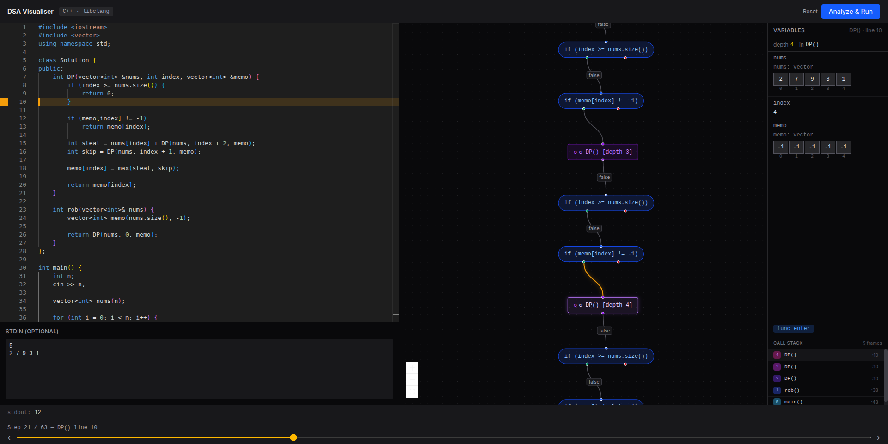
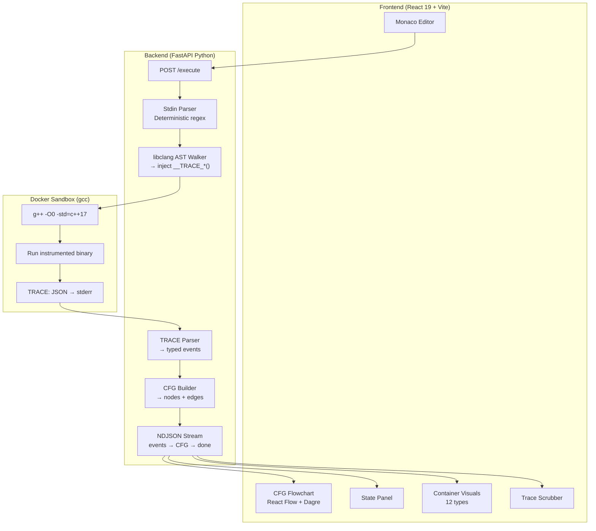
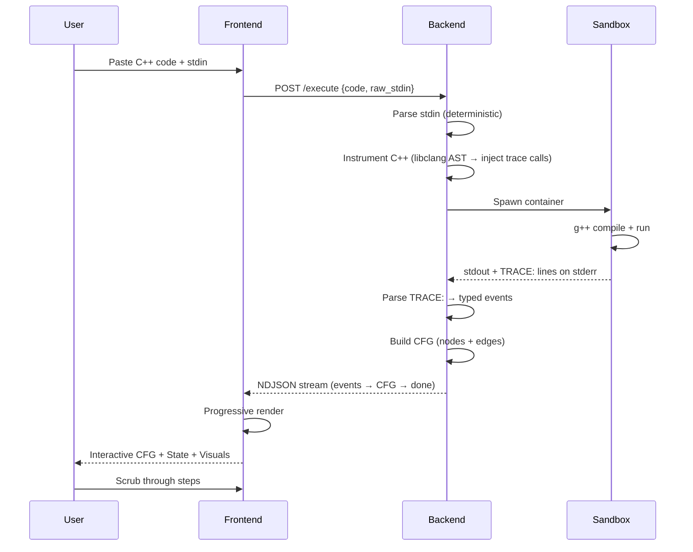

<p align="center">
  <picture>
    <source media="(prefers-color-scheme: dark)" srcset="resources/DSA-Vis.png">
    
  </picture>
</p>

<h1 align="center">DSA Visualiser</h1>

<p align="center">
  <strong>Step-by-step C++ visualisation for interview DSA &amp; competitive programming</strong>
</p>

<p align="center">
  <a href="#features">Features</a> •
  <a href="#quick-start">Quick Start</a> •
  <a href="#usage">Usage</a> •
  <a href="#architecture">Architecture</a> •
  <a href="#api">API</a> •
  <a href="#development">Development</a>
</p>

<!-- Badges -->
<p align="center">
  <a href="https://www.python.org/"></a>
  <a href="https://fastapi.tiangolo.com/"></a>
  <a href="https://react.dev/"></a>
  <a href="https://www.docker.com/"></a>
  <a href="https://www.typescriptlang.org/"></a>
  <br>
  <a href="LICENSE"></a>
  
</p>

<br>

> [!NOTE]
> **Zero external dependencies.** No LLM, no API keys, no cloud services. Everything runs locally via Docker.

---

## Demo

```bash
docker compose up --build
# → http://localhost:9001
```

Paste any C++ interview problem, click **Run**, and scrub through every step of execution.

<br>

## Features

### Visualisation Types

| Component | Detects | Preview |
|---|---|---|
| `VectorVisual` | `vector`, `deque`, `array` | Indexed horizontal boxes with highlight |
| `StackVisual` | `stack` | Vertical stack with top marker |
| `QueueVisual` | `queue` | Horizontal queue with front/back arrows |
| `MapVisual` | `map`, `unordered_map` | Key-value table |
| `SetVisual` | `set`, `unordered_set`, `multiset` | Teal boxes with overflow handling |
| `HeapVisual` | `priority_queue` | Binary heap tree with bubble-up/down animation |
| `GraphAlgorithmVisual` | 2D jagged arrays | BFS/DFS/Dijkstra with multi-state node coloring |
| `DPTableVisual` | Rectangular 2D arrays | Table with dependency arrows & recurrence tooltips |
| `GridVisual` | 2D matrices | Heatmap, flood fill, path tracing |
| `TrieVisual` | Nested pointer structures | Prefix tree with insertion/search animation |
| `LinkedListVisual` | Pointer-linked nodes | Animated insert/delete with cycle detection |
| `MultiStructureSyncView` | Multiple variables | Side-by-side synchronized views |

### Core Capabilities

- **C++ Instrumentation** — Automatic trace-call injection via libclang AST walker. No manual annotations.
- **Interactive CFG** — React Flow chart with Dagre layout. Branch diamonds, loop expand/collapse, recursion trees.
- **Step Scrubber** — Navigate execution step-by-step with slider, buttons, or keyboard (← → Home End).
- **Variable State Panel** — All in-scope variables at every step with change highlighting and call-stack depth.
- **Test Case Manager** — Upload `.in`/`.out` files, batch-run multiple cases, view pass/fail diffs.
- **Streaming Traces** — NDJSON streaming renders progressive traces — no waiting for full execution.

<br>

## Quick Start

> [!TIP]
> **Only Docker is required.** The sandbox image builds automatically on first run.

```bash
git clone https://github.com/yourusername/DSA-Visualiser.git
cd DSA-Visualiser
docker compose up --build
```

Open **[http://localhost:9001](http://localhost:9001)** and paste your C++ code.

<br>

## Usage

### 1. Write Code

Paste any C++ program. Supported:
- `vector`, `stack`, `queue`, `map`, `set`, `priority_queue`
- `pair`, `tuple`, `array`, raw C arrays
- Nested containers (`vector<vector<int>>`, `map<string, vector<int>>`)
- `if`/`else`, `switch`/`case`, `for`, `while`, `do-while`
- Functions and recursion

### 2. Add Input

```
# Clean input (passes through):
5
1 2 3 4 5

# With prose (auto-stripped):
5 elements: 1 2 3 4 5
```

### 3. Run & Explore

Click **Run**. Watch the trace stream in:
- **Scrub** with slider or arrow keys
- **Click** CFG nodes to jump to that step
- **Expand** loops to see individual iterations
- **Hover** container values for full details
- **Watch** variables highlight amber on change

### 4. Batch Testing (CP-Style)

```
Upload:  input1.in  +  expected1.out
         input2.in  +  expected2.out

Run:     Click "Run Batch"

Result:  ✓ PASS  |  ✗ FAIL (side-by-side diff)
```

<br>

## Architecture



### Pipeline Detail



<br>

## Project Structure

```
backend/
├── app/
│   ├── main.py                       # FastAPI entry, CORS, route registration
│   ├── api/routes/
│   │   └── execute.py                # POST /execute, /execute-batch, streaming
│   ├── core/
│   │   ├── instrumenter/
│   │   │   ├── tracer.h              # C++ runtime logger (26+ serializer overloads)
│   │   │   ├── ast_walker.py         # libclang AST → injection points
│   │   │   ├── scope_tracker.py      # Variable scope map per function
│   │   │   └── injector.py           # Source rewriter
│   │   ├── executor/
│   │   │   ├── docker_runner.py      # Docker sandbox execution
│   │   │   └── sandbox_config.py     # Resource limits (128MB, 10s timeout)
│   │   ├── trace/
│   │   │   ├── models.py             # Pydantic event models (source of truth)
│   │   │   ├── parser.py             # TRACE: → TraceEvent list
│   │   │   └── cfg_builder.py        # Trace → CFG nodes/edges
│   │   └── stdin/
│   │       └── parser.py             # Deterministic stdin cleaner
│   └── models/
│       ├── request.py                # API request schemas
│       └── response.py               # API response schemas
├── tests/                            # 100+ pytest tests
│   ├── test_serializers.py
│   ├── test_stdin_parser.py
│   ├── test_api_endpoints.py
│   └── test_streaming.py
└── docker/
    └── Dockerfile.sandbox            # gcc:latest execution sandbox

frontend/
├── src/
│   ├── components/
│   │   ├── Editor/                   # Monaco code editor + InputPanel
│   │   ├── FlowChart/                # React Flow + custom nodes/edges
│   │   ├── StatePanel/               # Variable state + call stack
│   │   ├── ContainerVisuals/         # 12 visual components
│   │   ├── Scrubber/                 # Trace navigation slider
│   │   └── DiffViewer/               # Expected vs actual output diff
│   ├── store/                        # Zustand (traceStore, cfgStore, uiStore)
│   ├── hooks/                        # useContainerType, useTraceNavigation
│   └── utils/                        # API client, CFG layout
├── tests/                            # Playwright visual regression (18 tests)
└── playwright.config.ts
```

<br>

## API

### `POST /execute`

Submit C++ code for instrumentation, execution, and trace generation.

```json
// Request
{
  "code": "#include <vector>\n...",
  "raw_stdin": "5\n1 2 3 4 5",
  "compressed": false
}

// Response (JSON — compressed=false)
{
  "stdout": "Found at index: 3\n",
  "compile_error": null,
  "runtime_error": null,
  "trace": [
    {"t":"enter","l":5,"f":"bsearch","d":1,"p":{"arr":[1,3,5,7,9],"target":7}},
    {"t":"state","l":6,"f":"bsearch","d":1,"v":{"lo":0,"hi":4}},
    {"t":"branch","l":9,"f":"bsearch","d":1,"c":"arr[mid]==target","tk":false},
    {"t":"iter","l":7,"f":"bsearch","d":1,"it":0},
    {"t":"exit","l":13,"f":"bsearch","d":1,"r":3}
  ],
  "cfg_nodes": [...],
  "cfg_edges": [...],
  "total_steps": 16,
  "truncated": false
}
```

> **Streaming mode:** Set `"compressed": true` to get an NDJSON stream (`Content-Type: application/x-ndjson`). Each trace event arrives as a separate JSON line. The final line contains the CFG + metadata.

### `POST /execute-batch`

Run multiple test cases against the same code in parallel.

```json
// Request
{
  "code": "...",
  "test_ids": ["uuid-1", "uuid-2"]
}

// Response
[
  {"test_id": "uuid-1", "stdout": "6\n", "passed": true, ...},
  {"test_id": "uuid-2", "stdout": "10\n", "passed": false, ...}
]
```

### `POST /upload-testcases`

Upload test case files for batch execution.

```
POST /upload-testcases (multipart/form-data)
Files: input1.in, expected1.out, input2.in, expected2.out
```

<br>

## Testing

```bash
# Backend tests (100+)
cd backend
uv run pytest tests/ -v

# Frontend visual regression tests (18)
cd frontend
npx playwright test

# Build sandbox image (for backend tests)
docker build -f backend/docker/Dockerfile.sandbox \
  -t dsa-sandbox:latest backend/docker/
```

<br>

## Development

### Prerequisites

| Tool | Version | Install |
|---|---|---|
| Python | 3.11+ | [python.org](https://python.org) |
| uv | latest | `pip install uv` or `curl -LsSf https://astral.sh/uv/install.sh \| sh` |
| Bun | latest | `curl -fsSL https://bun.sh/install \| bash` |
| Docker | latest | [docker.com](https://docker.com) |

### Backend

```bash
cd backend
uv sync --extra dev
docker build -f docker/Dockerfile.sandbox -t dsa-sandbox:latest docker/
uv run uvicorn app.main:app --reload --port 8000
```

### Frontend

```bash
cd frontend
bun install
bun run dev     # → http://localhost:5173
```

<br>

## Design Decisions

<details>
<summary><strong>Why libclang over regex?</strong></summary>
C++ grammar is not regular. One missed edge case in a regex parser silently corrupts the trace. libclang provides the full AST, handles templates, macros, and overload resolution correctly.
</details>

<details>
<summary><strong>Why instrumentation over GDB?</strong></summary>
GDB tracing is slow (~1ms/step), fragile (depends on debug symbols), and hard to sandbox. Instrumentation compiles to native speed and produces exactly the events we need.
</details>

<details>
<summary><strong>Why dynamic CFG over static analysis?</strong></summary>
C++ static CFG analysis is extremely complex (templates, macros, virtual dispatch). Building the CFG dynamically from the trace is simpler, always correct, and shows only the paths actually taken.
</details>

<details>
<summary><strong>Why no LLM?</strong></summary>
Pure deterministic pipeline. No external API calls, no model downloads, no API keys. The Docker image stays ~2GB instead of ~15GB with Ollama. Stdin cleaning uses a regex-based parser instead.
</details>

<details>
<summary><strong>Why Dagre for layout?</strong></summary>
Sequential `y = i * 80` stacking makes branch nodes look linear. Dagre's hierarchical layout forks branch nodes left/right and curves loop back-edges, making the control flow immediately readable.
</details>

<br>

## Known Limitations

- Template functions (e.g., `template<typename T>`) are not instrumented — only their concrete instantiations that call non-template user functions are traced
- Programs with `#define` macros may produce incorrect line numbers in some cases
- Very deep recursion (>1000 frames) will hit the execution timeout or trace line limit
- Multi-threaded programs are not supported (trace events would interleave)

<br>

## Contributing

Contributions are welcome! See [CONTRIBUTING.md](CONTRIBUTING.md) for guidelines.

<br>

## License

[MIT](LICENSE)

<br>

---

<p align="center">
  Made with ❤️ — built for the DSA community
</p>
